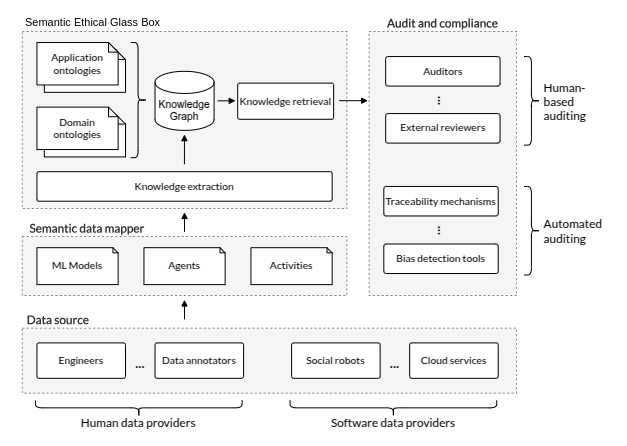

<<<<<<< HEAD
# Semantic Ethical Glass Box (SEGB)

## 1. The AMOR Project

The AMOR Project aims to develop critical thinking and the ability to manage one's emotions when engaging with media and social networks, in order to combat phenomena such as disinformation, hate speech, and clickbait.

The general objectives of the project are defined around its strategic lines, as follows:

- Research semantic text analysis techniques that facilitate cooperative processing in the cloud and at the edge.

- Investigate the analysis and application of moral and ethical values, including their auditing.

- Explore new visualization techniques and immersive interaction that make effective use of textual data analysis. This includes the development of sector-specific applications that promote social awareness on issues such as rural depopulation, the risk of radicalization among vulnerable groups, and the needs of the elderly and dependent individuals.

This project is funded by the Ministry of Economic Affairs and Digital Transformation and the European Union – NextGeneration EU, within the UNICO I+D Cloud Program.

## 2. Introduction to the Semantic Ethical Glass Box

The Semantic Ethical Glass Box (SEGB) is a system designed to persisently store a global semantic registry of all in-
teractions, decisions, or activities carried out by various Artificial Intelligence (AI)-based agents within a specific
scenario or environment. The objective is allowing that these events can later be consulted to audit, analyze, and debug the
agents’ behavior. Let's break the name in order to better understand the cpncept:

- *Semantic*: The SEGB stores all the events within a global knowledge graph, i.e, makes use of semantics -by using Resource Description Framework (RDF)- to describe the information happened within the scenario. Using semantics gives place to a categorized, standarized and controlled modelling of the agents & avents existing in the scenario, offering some advantages such us 1) making advanced queries to the graph thanks to the well-defined meaningful
relations and properties, or 2) extend from other standardized third-party ontologies for modelling our enviroment.

- *Ethical*: The SEGB aims to provide insights in terms of AI interpretability & explainability, whose underlying com-
plexity limits humans from understanding why an action was executed or how a
decision was reasoned. But why are interpretability & explainability so important? This help us understand why an unexpected, harmful action or decision was carried out, with the objective of ensuring the fairness and *ethics* of AI-based agents. This is crucial for achiving a good reliability, which is specially remarkable in high accountability scenarios where the AI-based decisions can significatively affect people.

- *Glass*: In order to ensure this reliability and interpretability, the SEGB enhances the concepts of transparency
and traceability of registered events. Looking inside this glass box do allow auditor follow step by step what a AI-agent reasoned and excecuted in every moment.

- *Box*: It represents a storage bucket where all the events occurred are stored by the AI-based agents. This events are joined and persistently saved, conforming the global registry.

The SEGB arises as part of the AMOR project, as it uses AI-based robots and imersive environments to interact with different groups of people, requiring these agents' ethical behaviour in order to meet the objectives. This implies being able to explain and interpret why a decision/action was produced and ensuring the ethics and transparency of these gents' behaviour.

Nevertheless, the SEGB is appliable to any scenario, as long as the AI-based agents have an Internet connection and the capability of generating TTL-formated logs.

## 3. Design of the SEGB

### 3.1. Semantic Model

The SEGB ontology can be found in:

- **File**: <https://github.com/gsi-upm/segb/blob/main/ontology/example.ttl>
- **URL**: <http://www.gsi.upm.es/ontologies/segb/examples#>

### 3.2. Knowledge Graph Construction Pipeline

## 4. SEGB Tutorial

In the folder [tutorial](./tutorial), an extensive use case is presented in a notebook to help understand the usability and capabilities of the SEGB.

The complete documentation & tutorial are available in [SEGB documentation](https://segb.readthedocs.io/en/latest/index.html).
=======
# TFG_Gloria
>>>>>>> 910405018b32ffe8cb299de39347ef426e38afc6
